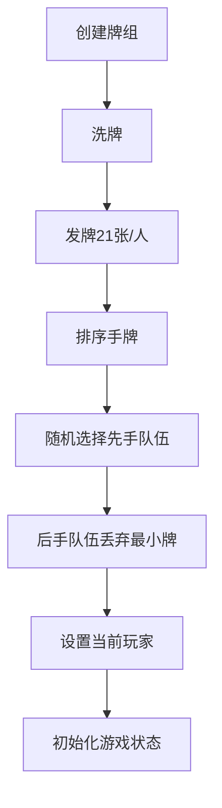

# 腾讯欢乐斗地主2V2环境详细说明书

## 1. 环境概述

### 1.1 功能定位
本环境实现了腾讯欢乐斗地主2V2模式的完整规则模拟，提供以下核心功能：
- **规则精准模拟**：完整实现84张牌发牌、后手特权、多种炸弹类型等核心规则
- **状态空间建模**：构建6通道状态张量表示游戏完整状态
- **动作空间支持**：支持"不出"和多种出牌动作
- **奖励系统**：实现炸弹奖励、春天奖励、资源惩罚等激励机制
- **回合管理**：自动处理连续PASS导致的回合结束
- **胜负判定**：准确判定队伍胜利和春天/反春天条件

### 1.2 环境特性
| 特性 | 描述 | 实现类 |
|------|------|--------|
| **规则准确性** | 严格遵循官方规则 | `LandlordEnv2v2` |
| **状态完整性** | 6通道状态表示 | `_get_state()` |
| **动作多样性** | 支持多种牌型 | `CardType`枚举 |
| **策略支持** | 队友配合奖励机制 | `_is_helping_teammate()` |
| **高效计算** | 基于NumPy的状态编码 | 各`_encode_*`方法 |

## 2. 核心类与枚举

### 2.1 CardType 枚举
```python
class CardType(Enum):
    PASS = 0          # 不出
    SINGLE = 1        # 单张
    PAIR = 2          # 对子
    TRIPLE = 3        # 三张
    TRIPLE_WITH_SINGLE = 4   # 三带一
    # ... 其他牌型 ...
    BOMB = 13         # 普通炸弹
    KING_BOMB = 14    # 王炸
```
- **设计要点**：完整覆盖官方牌型，炸弹和王炸单独分类
- **使用场景**：牌型识别、动作合法性检查

### 2.2 Card 类
```python
class Card:
    RANKS = ['6', '7', '8', '9', '10', 'J', 'Q', 'K', 'A', '2']
    SUITS = ['S', 'H', 'C', 'D']
    JOKERS = ['BJ', 'CJ']
    
    def __init__(self, rank: str, suit: str = None):
        self.rank = rank
        self.suit = suit
        self.is_joker = suit is None
        
    @property
    def value(self) -> int:
        if self.is_joker:
            return 10 if self.rank == 'BJ' else 11
        return Card.RANKS.index(self.rank)
```
- **数值系统**：
  ```
  6=0, 7=1, 8=2, 9=3, 10=4, J=5, Q=6, K=7, A=8, 2=9, 小王=10, 大王=11
  ```
- **关键方法**：
  - `value`: 获取卡牌数值（用于比较大小）
  - `from_value`: 从数值创建卡牌（用于测试）

### 2.3 CardGroup 类
```python
class CardGroup:
    def __init__(self, card_type, main_rank, cards=None):
        self.card_type = card_type
        self.main_rank = main_rank
        self.cards = cards or []
    
    @property
    def strength(self) -> int:
        if self.card_type == CardType.KING_BOMB:
            return {2:2000, 3:5000, 4:8000}.get(len(self.cards), 2000)
        if self.card_type == CardType.BOMB:
            return {4:1000,5:3000,6:4000,7:6000,8:7000}.get(len(self.cards),1000) + self.main_rank
        return self.main_rank
```
- **强度计算规则**：
  | 炸弹类型 | 强度公式 | 倍数 |
  |----------|----------|------|
  | 四炸 | 1000 + 点数 | ×2 |
  | 双王炸 | 2000 | ×4 |
  | 五炸 | 3000 + 点数 | ×4 |
  | 六炸 | 4000 + 点数 | ×4 |
  | 三王炸 | 5000 | ×4 |
  | 七炸 | 6000 + 点数 | ×4 |
  | 八炸 | 7000 + 点数 | ×4 |
  | 四王炸 | 8000 | ×4 |

### 2.4 Config 类
```python
class Config:
    def __init__(self):
        self.NUM_PLAYERS = 4  # 玩家数量
        self.TEAM_A = [0, 2]  # A队玩家ID
        self.TEAM_B = [1, 3]  # B队玩家ID
        self.STATE_SHAPE = (6, 16)  # 状态张量形状
```
- **设计要点**：集中管理配置参数，便于扩展

## 3. 游戏流程

### 3.1 初始化流程


### 3.2 出牌回合流程
```python
def step(self, action):
    if action == 0:  # PASS
        记录PASS历史
        检查回合结束条件
    else:  # 出牌
        验证出牌合法性
        从手牌移除卡牌
        更新最后出牌状态
        处理炸弹倍率
        检查游戏结束
        计算奖励
    更新当前玩家
    返回新状态
```

### 3.3 胜负判定
- **胜利条件**：任一玩家出完手牌
- **春天判定**：
  ```python
  def _is_spring(self):
      losing_team = 失败队伍
      losing_rounds = 失败队伍出牌轮次集合
      return len(losing_rounds) <= 1
  ```
- **计分公式**：  
  `总分 = 底分 × 倍数 × (春天系数)`

## 4. 状态表示

### 4.1 状态张量结构
| 通道 | 维度 | 描述 | 编码方法 |
|------|------|------|----------|
| 0 | 1×16 | 当前玩家手牌 | `_encode_hand` |
| 1 | 1×16 | 队友手牌 | `_encode_hand` |
| 2 | 1×16 | 对手1已出牌 | `_encode_played_cards` |
| 3 | 1×16 | 对手2已出牌 | `_encode_played_cards` |
| 4 | 5×2 | 历史记录 | `_encode_history` |
| 5 | 2×6 | 游戏状态 | `_encode_game_state` |

### 4.2 游戏状态通道详解
**通道5 [0, :]：**
- `[0]`：当前玩家ID
- `[1]`：最后出牌玩家ID
- `[2]`：当前倍数
- `[3]`：炸弹使用标志（0/1）
- `[4]`：最后牌型枚举值
- `[5]`：最后牌组主点数

**通道5 [1, :]：**
- `[0-3]`：四位玩家手牌数量

## 5. 动作空间

### 5.1 动作类型
| 动作ID | 类型 | 描述 |
|--------|------|------|
| 0 | PASS | 不出牌 |
| 1+ | 出牌 | 各种牌型组合 |

### 5.2 动作转换逻辑
```python
def _action_to_card_group(action):
    if action == 0:  # PASS
        return CardGroup(CardType.PASS, -1)
    
    # 当前策略：出最小单牌
    min_card = min(hand, key=lambda c: c.value)
    return CardGroup(CardType.SINGLE, min_card.value, [min_card])
```
*注：当前实现为简化版本，可扩展支持更多牌型*

## 6. 奖励设计

### 6.1 奖励组成
| 奖励类型 | 计算方式 | 目的 |
|----------|----------|------|
| **炸弹奖励** | 四炸+0.3, 其他+0.5 | 鼓励合理使用炸弹 |
| **队友配合** | +0.2 | 促进团队合作 |
| **最终奖励** | ±(10×倍数×春天系数) | 胜负主要奖励 |
| **资源惩罚** | -Σ(大牌惩罚) | 避免囤积大牌 |

### 6.2 资源惩罚计算
```python
def _calculate_resource_penalty():
    penalty = 0.0
    for card in hand:
        if card.value == 10 or 11:  # 大小王
            penalty += 0.1
        elif card.value == 9:  # 2
            penalty += 0.05
    return penalty
```

## 7. 规则实现细节

### 7.1 出牌合法性检查
```python
def _is_valid_move(card_group):
    # PASS总是合法
    if PASS: return True
    
    # 首轮无限制
    if 首轮: return True
    
    # 上家是队友可任意出
    if 上家是队友: return True
    
    # 炸弹压制规则
    if 上家是炸弹:
        return 当前是炸弹 and 强度 > 上家强度
        
    # 同类型比较
    if 相同牌型:
        return 当前强度 > 上家强度
        
    # 炸弹可压制非炸弹
    if 当前是炸弹: return True
    
    return False
```

### 7.2 回合结束条件
```python
def _is_round_end():
    if 历史记录 < 3条: return False
    return 最近三条历史都是PASS
```

### 7.3 后手特权实现
```python
# 后手队伍丢弃最小牌
for player in second_team:
    min_card = min(hand, key=lambda c: c.value)
    hand.remove(min_card)
```

## 8. 策略性设计

### 8.1 队友配合机制
```python
def _is_helping_teammate():
    # 上家是队友
    if 上家是队友: return True
    
    # 为队友创造接牌机会
    if 手牌数 > 上家牌数+2: return True
    
    return False
```

### 8.2 状态编码策略
- **手牌编码**：二进制表示（0/1）
- **已出牌编码**：计数表示
- **历史记录**：保留最近5步
- **游戏状态**：混合数值类型

## 9. 使用示例

### 9.1 环境初始化
```python
env = LandlordEnv2v2(seed=42)
state = env.reset()
```

### 9.2 执行动作
```python
action = 1  # 出最小牌
next_state, reward, done, info = env.step(action)
```

### 9.3 状态信息
```python
print(f"状态形状: {state.shape}")
print(f"当前玩家: {info['current_player']}")
print(f"游戏倍数: {info['multiplier']}")
```

### 9.4 完整测试流程
```python
for step in range(100):
    action = choose_action(state)  # 智能体决策
    state, reward, done, info = env.step(action)
    
    if done:
        print(f"游戏结束! 获胜队伍: {'A' if info['winner']==0 else 'B'}")
        break
```

## 10. 扩展与优化方向

### 10.1 待实现功能
1. **完整牌型支持**：扩展支持顺子、飞机等复杂牌型
2. **动作空间扩展**：增加牌型选择维度
3. **记牌器功能**：实现对手剩余牌型统计
4. **通信机制**：队友间信息传递模拟

### 10.2 性能优化
- **状态压缩**：使用稀疏矩阵表示
- **缓存机制**：缓存频繁访问的状态
- **并行处理**：支持多环境并行

本环境严格遵循腾讯欢乐斗地主2V2规则，通过模块化设计实现了游戏核心机制，为强化学习算法提供了可靠的训练平台。